# React Native E-Commerce App

### Technical Assessment — Royal Brothers

## 1. Project Setup

Follow these steps to run the application on your local machine:

### Prerequisites

- **Node.js**: `v22.11.0` or higher (verified in `package.json` engines)
- **CocoaPods** (for iOS builds)
- **Android SDK & Build Tools** (for Android builds)

### Installation

1. Clone the repository and navigate to the project directory:
   ```bash
   cd ecommerce
   ```
2. Install npm dependencies:
   ```bash
   npm install
   ```
3. Install iOS CocoaPods:
   ```bash
   cd ios && pod install && cd ..
   ```

### Running the App

- **Start the Metro Bundler**:
  ```bash
  npm start
  ```
- **Run on Android**:
  ```bash
  npm run android
  ```
  _(Runs `react-native run-android --main-activity .MainActivityDefault`)_
- **Run on iOS**:
  ```bash
  npm run ios
  ```

---

## 2. Folder Structure & Architecture

### Folder Structure

```
ecommerce/
├── android/
│   └── app/src/main/java/com/ecommerce/
│       └── DynamicAppIconModule.kt
├── ios/
└── src/
    ├── api/
    │   ├── axiosInstance.ts
    │   └── productApi.ts
    ├── components/
    │   ├── Home/
    │   │   ├── FilterBottomSheet.tsx
    │   │   └── ProductCard.tsx
    │   ├── cart/
    │   │   └── CartCard.tsx
    │   ├── productDetails/
    │   │   ├── ProductBottomBar.tsx
    │   │   ├── ProductDescription.tsx
    │   │   ├── ProductHeaderImage.tsx
    │   │   ├── ProductInfoList.tsx
    │   │   ├── ProductPriceBox.tsx
    │   │   ├── ProductReviews.tsx
    │   │   ├── ProductSpecifications.tsx
    │   │   └── ProductTitleInfo.tsx
    │   ├── InvalidLinkModal.tsx
    │   └── NoInternetModal.tsx
    ├── hooks/
    │   ├── useDebounce.ts
    │   └── useDynamicAppIcon.ts
    ├── navigations/
    │   ├── AppNav.tsx
    │   └── TabNav.tsx
    ├── screens/
    │   ├── tabs/
    │   │   ├── Cart.tsx
    │   │   ├── Home.tsx
    │   │   └── Profile.tsx
    │   ├── Checkout.tsx
    │   ├── Login.tsx
    │   └── ProductDetails.tsx
    ├── store/
    │   ├── slices/
    │   │   ├── cartSlice.ts
    │   │   ├── checkoutSlice.ts
    │   │   ├── deepLinkSlice.ts
    │   │   └── userSlice.ts
    │   └── store.ts
    ├── theme/
    │   └── colors.ts
    ├── types/
    │   ├── product.ts
    │   └── react-native-dynamic-app-icon.d.ts
    └── utils/
        ├── appIconManager.ts
        ├── appIconStorage.ts
        └── deepLinkHandler.ts
```

### Architecture

The project follows a **Layer-Based (Type-First) Architecture** — the top-level `src/` folders are organized by their **technical responsibility** (`screens/`, `components/`, `store/`, `api/`, `hooks/`, `utils/`, `types/`, `theme/`), not by individual feature folders.

- **`screens/`** — Contains all screen-level components. Each screen manages its own data fetching via direct API calls and local `useState`/`useEffect`. No ViewModel or controller layer sits in between.
- **`components/`** — Reusable UI pieces, further grouped into subfolders by the screen they serve (`Home/`, `cart/`, `productDetails/`).
- **`store/`** — Redux Toolkit slices handling only cross-screen shared state (cart, user, checkout, deepLink). API data is not cached in Redux — it lives in screen-local state. Persisted via MMKV for synchronous reads on cold start.
- **`api/`** — Thin Axios wrapper and service functions. Screens import and call these directly.
- **`utils/`** — Standalone helper modules for cross-cutting concerns (deep link parsing, app icon scheduling). Pure functions, independent of React lifecycle.
- **`hooks/`** — Custom hooks encapsulating reusable side-effect logic (`useDynamicAppIcon`, `useDebounce`).
- **`types/`** — Shared TypeScript interfaces and type declarations.
- **`theme/`** — Centralized color and styling constants.
- **`navigations/`** — Stack and Tab navigator configuration.

---

## 3. API Reference & Endpoints

The application utilizes **DummyJSON API** (`https://dummyjson.com/`) as its mock REST backend server. Connections are handled via a custom Axios client configuration featuring request timeouts:

### Configured Endpoints

- **`GET /products`**
  - _Purpose_: Fetches standard product catalogs.
  - _Parameters_: Supports `limit` (pagination page size), `skip` (offset), `sortBy` (sort field), and `order` (`asc`/`desc`).
- **`GET /products/{id}`**
  - _Purpose_: Retrieves detailed attributes for a single product.
  - _Validation Role_: Used in deep linking (`myapp://product/<id>`) to check if a product exists on the server before directing navigation.
- **`GET /products/search`**
  - _Purpose_: Queries products matching a text string.
  - _Parameters_: Takes query text `q` plus pagination parameters.
- **`GET /products/category-list`**
  - _Purpose_: Fetches list of categories.
  - _Validation Role_: Used in deep linking (`myapp://category/<name>`) to match the user's category parameter case-insensitively before loading.
- **`GET /products/category/{categoryName}`**
  - _Purpose_: Filters products by a specific category.

---

## 4. Tech Stack

The application utilizes a curated list of modern React Native packages, selected for efficiency, performance, and native feel:

| Package                             | Purpose                  | Why It Was Chosen                                                                                                                                                                                                   |
| :---------------------------------- | :----------------------- | :------------------------------------------------------------------------------------------------------------------------------------------------------------------------------------------------------------------ |
| **React Native (v0.87.0)**          | Core Framework           | Enables cross-platform compilation to high-performing native components on Android and iOS.                                                                                                                         |
| **Redux Toolkit & React Redux**     | State Management         | Standardizes predictable global state across slices (`cart`, `user`, `checkout`, `deepLink`) with boilerplate-free syntax.                                                                                          |
| **Redux Persist (v6.0.0)**          | State Persistence        | Ensures user sessions, cart items, and checkout details survive app process death.                                                                                                                                  |
| **React Native MMKV (v4.3.2)**      | High-Performance Storage | A C++-based, synchronous key-value storage. Replaces slow asynchronous AsyncStorage to provide instantaneous reads at app launch. Serves as the storage adapter for Redux Persist and stores the App Icon schedule. |
| **React Navigation (v7.x)**         | Routing & Navigation     | Offers seamless native-like stack and bottom-tab transitions.                                                                                                                                                       |
| **Shopify FlashList (v2.3.2)**      | Highly-Optimized Lists   | Recycles views to provide extremely smooth 60 FPS list scrolling, crucial for product catalogs with heavy images.                                                                                                   |
| **React Native Dynamic App Icon**   | iOS App Icon Swapping    | Native bridge wrapper to change alternate icons on iOS.                                                                                                                                                             |
| **React Native Date Picker (v5.x)** | Native Date Picker       | Integrates platform-native date/time spinner wheels for scheduling promotions.                                                                                                                                      |
| **Confetti Cannon (v1.5.x)**        | Visual Reward / Feedback | Delights users upon checkout success with a lightweight canvas confetti animation.                                                                                                                                  |
| **NetInfo (v12.x)**                 | Network Listener         | Continuously monitors internet status to gracefully handle offline transitions.                                                                                                                                     |
| **Toast Message (v2.x)**            | Micro-Interactions       | Provides clean, non-blocking toast notifications (success, warning, info) for system changes.                                                                                                                       |

---

## 5. E-commerce Features

- **Product Catalog (`Home`)**:
  - Live product feed optimized with `FlashList` for smooth scrolling.
  - Category-based filtering and instant search capabilities.

<p align="center">
  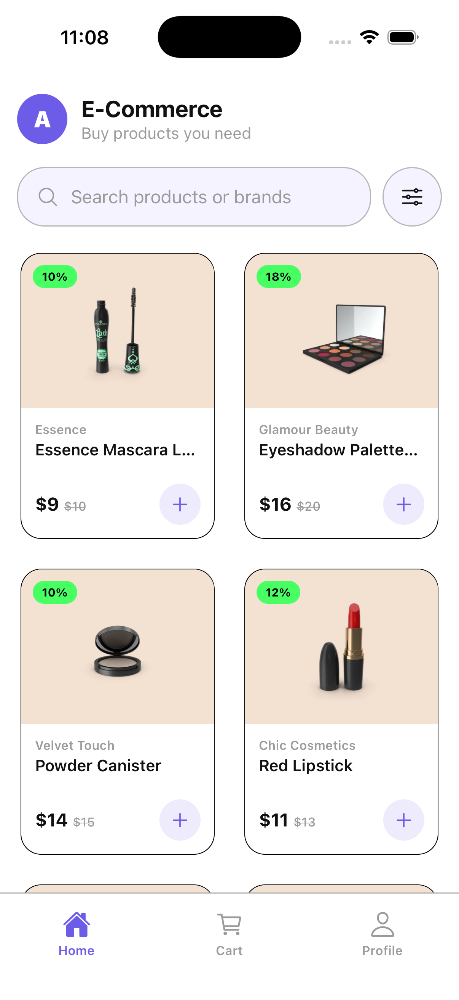
  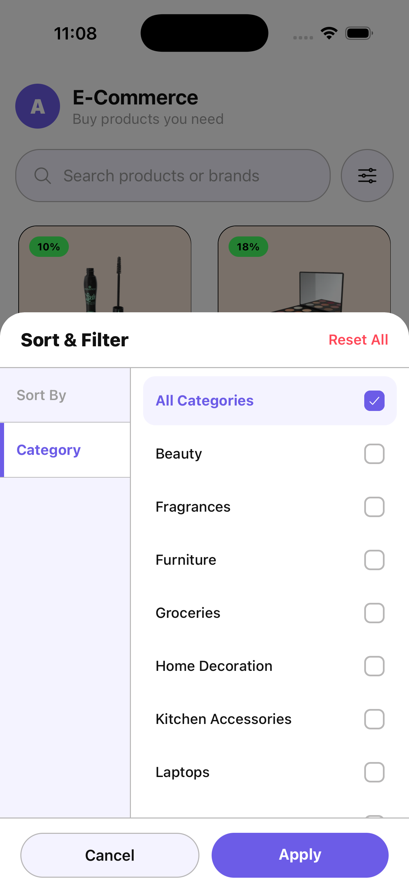
  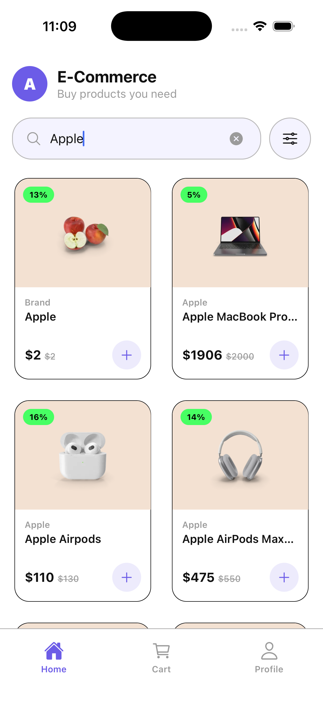
</p>

- **Product Details (`ProductDetails`)**:
  - Rich image galleries, ratings, and detailed specifications.
  - Automatically calculates and displays discount-adjusted pricing.

<p align="center">
  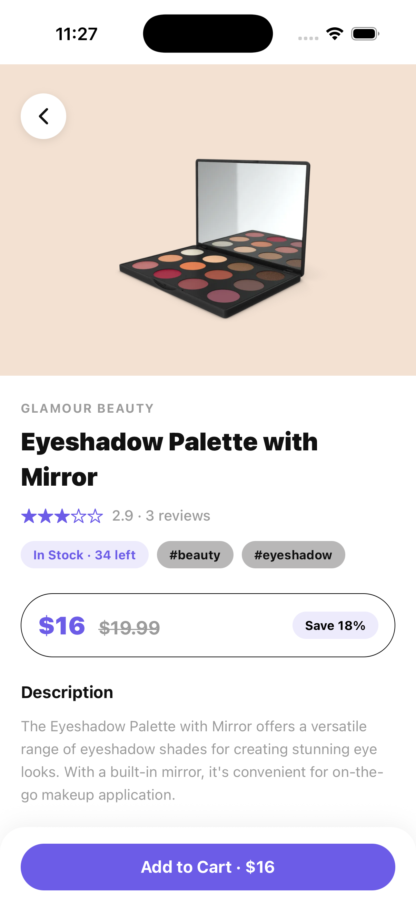
  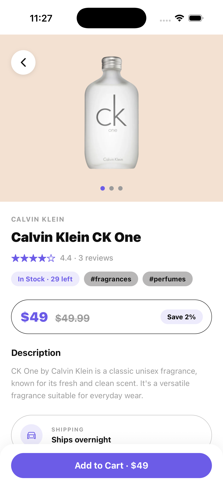
</p>

- **Persistent Shopping Cart (`Cart`) & Seamless Checkout**:
  - Offline-persisted cart items with quantity controls.
  - Persistent shipping addresses, payment validation (COD / Card / UPI).
  - Visual checkout reward featuring a confetti explosion and order receipt.

<p align="center">
  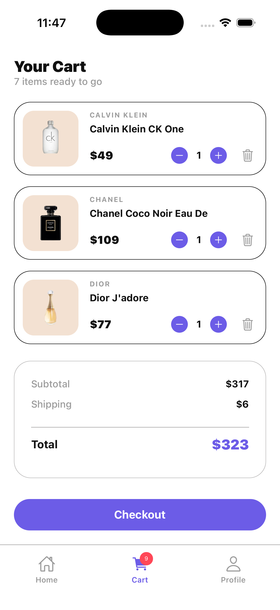
  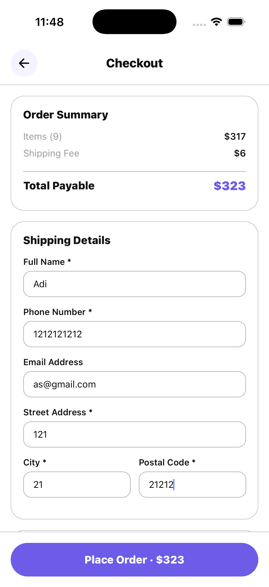
  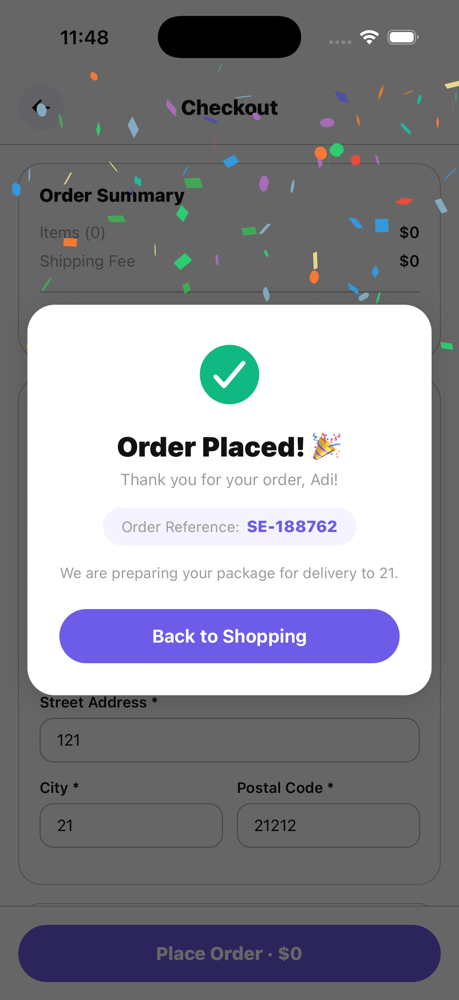
</p>

- **Secure Authentication (`Login` / `Profile`)**:
  - Clean regex validation for credentials.
  - Automatic redirect of pending deep links after successful login.
- **Network Safety Modal (`NoInternetModal`)**:
  - Full-screen connection block preventing network requests when offline, featuring an on-demand manual connection check.

---

## 6. Deep Linking

The app registers and normalizes the custom URL scheme: `myapp://`.

### Supported Routes

- `myapp://product/<productId>` - Navigates to a specific product's details page.
- `myapp://category/<categoryName>` - Opens the catalog pre-filtered by the given category name (case-insensitive).
- `myapp://cart` - Opens the user's cart (requires authentication).
- `myapp://profile` - Opens the user's profile settings page.

### Protected Route Flow (`myapp://cart`)

1. **Request Interception**: When a user opens `myapp://cart`, the `handleDeepLinkUrl` utility checks Redux for an authenticated email.
2. **Pending Registration**: If unauthenticated, the destination screen name `'cart'` is saved in the Redux store (`deepLink.pendingDeepLink`).
3. **Redirection & Alert**: The app displays an information toast ("Please log in to view your cart") and redirects the user to the `login` screen.
4. **Resuming Navigation**: Once the login details pass validation and the user is authenticated, the `Login` screen inspects `pendingDeepLink`. If it is `'cart'`, it clears the pending state and resets the stack navigation directly to the `Cart` tab.

### Invalid Deep Link Handling

If a deep link is unrecognized or contains invalid parameters, the application prevents navigation failures using the following validation rules:

1. **Invalid Product ID / ID Mismatch**:
   - If the URL structure is `myapp://product/<productId>` but the parameter is non-numeric (e.g., `myapp://product/abc`), zero/negative, or the backend product API queries fail (product ID not in database), the handler catches the error.
2. **Invalid Category / Missing Name**:
   - If the URL is `myapp://category/<categoryName>` but the category name parameter is missing or does not match any valid category retrieved from the category catalog, the check fails.
3. **Unrecognized Patterns**:
   - Any URL structure that does not map to registered routes (like `myapp://random-path`) is intercepted.

**Behavior on Failure**:

- The handler dispatches `setInvalidDeepLink` to store the invalid link metadata (`url`, error `title`, and descriptive `message`) in the Redux store.
- A full-screen overlay modal (**`InvalidLinkModal`**) is immediately presented to the user, displaying a detailed description of the error (e.g., _"Product #999 was not found or is no longer available"_).
- The modal features a prominent **Go to Home** button that resets the navigation stack to the Home tab and dismisses the overlay, preventing the user from getting stuck.

### How to Test Deep Linking

Ensure the simulator/emulator is booted and the app is running in the background.

#### Android (using ADB)

```bash
# Test Product Details navigation (valid product)
adb shell am start -W -a android.intent.action.VIEW -d "myapp://product/1" com.ecommerce

# Test Invalid Product ID (non-numeric name instead of ID)
adb shell am start -W -a android.intent.action.VIEW -d "myapp://product/noname" com.ecommerce

# Test Valid Category navigation
adb shell am start -W -a android.intent.action.VIEW -d "myapp://category/beauty" com.ecommerce

# Test Non-Existent Category
adb shell am start -W -a android.intent.action.VIEW -d "myapp://category/nocategory" com.ecommerce

# Test Protected Route Flow (will redirect to login, then cart upon authentication)
adb shell am start -W -a android.intent.action.VIEW -d "myapp://cart" com.ecommerce

# Test Unrecognized Route
adb shell am start -W -a android.intent.action.VIEW -d "myapp://invalidroute" com.ecommerce
```

#### iOS (using Simctl)

```bash
# Test Product Details navigation (valid product)
xcrun simctl openurl booted "myapp://product/1"

# Test Invalid Product ID (non-numeric name instead of ID)
xcrun simctl openurl booted "myapp://product/noname"

# Test Valid Category navigation
xcrun simctl openurl booted "myapp://category/beauty"

# Test Non-Existent Category
xcrun simctl openurl booted "myapp://category/nocategory"

# Test Protected Route Flow
xcrun simctl openurl booted "myapp://cart"

# Test Unrecognized Route
xcrun simctl openurl booted "myapp://invalidroute"
```

#### Deep Link Error Handling Screenshots

<p align="center">
  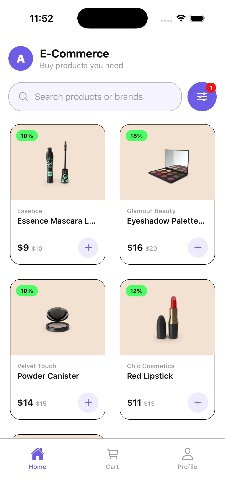
  
  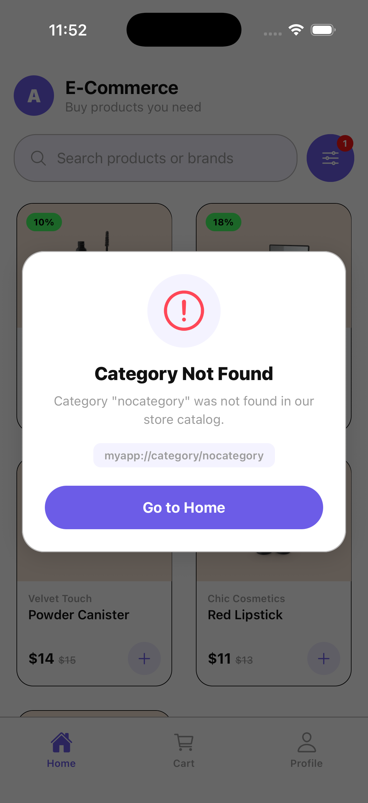
  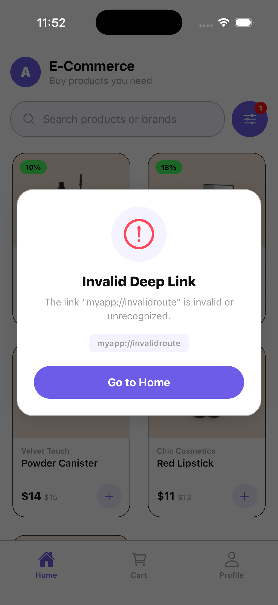
</p>

---

## 7. Dynamic App Icon

The app's most advanced utility allows marketers to schedule promotional application icons (e.g., during sales events) from the user profile screen.

### Approach Used

- **iOS**: Uses the `react-native-dynamic-app-icon` package which maps to Apple's native `setAlternateIconName` API. The alternate icon bundle is declared directly in iOS asset catalogs and target configuration.
- **Android**: Since Android does not provide an equivalent native API for app-icon switches, we created a custom Kotlin module: [DynamicAppIconModule.kt](./android/app/src/main/java/com/ecommerce/DynamicAppIconModule.kt).
  - Toggles between two `<activity-alias>` elements registered inside `AndroidManifest.xml`: `.MainActivityDefault` and `.MainActivityPromotional`.
  - Swaps states dynamically utilizing Android's native `PackageManager.setComponentEnabledSetting()`.

### Why Scheduled = On Launch / Foreground (Not Exact Time)

- Running exact-second timers in the background (like Android Services or iOS background agents) is highly throttled by mobile operating systems to prevent battery drainage and security exploits.
- **Solution**: The app uses a passive **Launch and Foreground evaluation pattern**.
- When the JS bundle loads at startup or when the application transitions from background to foreground (listening to `AppState === 'active'`), the custom `useDynamicAppIcon` hook triggers.
- It parses the schedule boundaries in MMKV against the current system time (`new Date()`) and triggers the icon update synchronously. This avoids background thread overhead entirely.

### MMKV Persistence

- The scheduled `startDate` and `endDate` boundaries are persisted as ISO-8601 strings in MMKV.
- MMKV stores values directly in memory-mapped files via JNI, executing synchronously. When the app boots, the schedule evaluation completes _before_ the JS thread renders the main UI stack, eliminating timing delays or layout jumps.

### Platform-Specific Limitations & Mitigations

> [!IMPORTANT] > **iOS System Dialog**:
> Apple's iOS strictly triggers a mandatory system dialog ("_You have changed the icon for..._") whenever the alternate icon changes. This cannot be suppressed.
> _Mitigation_: The manager calls `syncCurrentIconFromNative` to verify the actual native active icon name before attempting a switch. It only triggers the change if there is a true state mismatch, preventing repetitive dialog loops.

> [!WARNING] > **Android App Restart / Process Death**:
> Enabling or disabling a launcher `activity-alias` changes Android's default target entry point. The OS launcher reacts to this by terminating the app's task stack to rebuild the process intent (app restart).
> _Mitigation_: The Kotlin module implements a **Deferred Disable** pattern. When a change is triggered, the target activity is enabled immediately. However, the inactive activity is placed in a pending variable and is only disabled when the app transitions to the background (`onHostPause` or `onHostDestroy`), shielding the user from sudden app closures.

### How to Test Dynamic App Icons

1. Navigate to the **Profile** screen.
2. Under the **Dynamic App Icon** section, tap the **"1-Min Promo Active"** button.
   - This saves a promotional window in MMKV starting immediately and expiring in 1 minute.
   - _iOS_: Accept the system popup.
3. Immediately send the app to the background (go to device home screen).
   - _Android_: This triggers `onHostPause` and safely flushes the disable flag for the inactive alias.
4. Verify the home screen icon has updated to the **Promotional** icon.
5. Wait **1 minute** on the home screen.
6. Re-open the app (bringing it to the foreground).
   - The `AppState` listener triggers the evaluation hook.
   - The system detects the current time exceeds the end-date and schedules a reversion to the default icon.
7. Send the app back to the background.
8. Verify that the launcher icon has successfully reverted to the **Default** design.

#### iOS Icon Change Screenshots

<p align="center">
  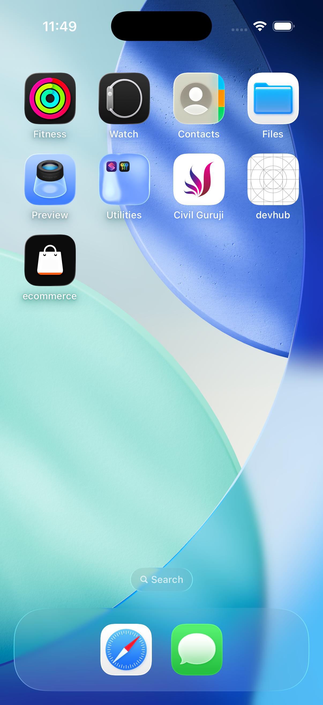
  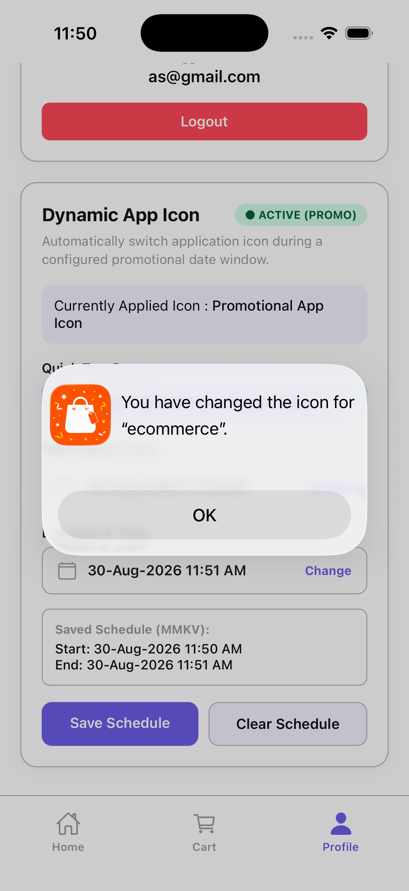
  
</p>

#### Android Icon Change Screenshots

<p align="center">
  
  
</p>

---

## 8. Edge Cases Handled

- **Invalid Date Configs**:
  - The UI prevents saving if the user sets `StartDate > EndDate`, displaying an error toast and preventing MMKV persistence.
  - The parser guards against invalid or corrupted dates (`isNaN` boundaries) and safely falls back to the default icon state.
- **Offline / Flaky Network**:
  - Real-time connection updates dynamically display a blocking screen overlay.
  - The retry button implements a loading indicator and visual toast feedback once connectivity resumes.
- **Device Restart & Cold Starts**:
  - Redux Persist and MMKV schedule settings survive device rebooting. The launch hook checks the schedule immediately on fresh start, applying the native icon changes before visual assets load.
- **Timezone Travel Safety**:
  - All date schedules are stored as UTC string formats (`toISOString()`). Comparisons use the raw system epoch timestamps, preventing icon scheduling offsets when users cross timezone lines.

---

## 9. Known Limitations

- **Custom Android Launchers (Samsung One UI, Xiaomi MIUI/HyperOS, Oppo ColorOS, etc.) Icon Cache Lag**:
  - Toggling activity-aliases dynamically on Android forces the system launcher to update its cache. On devices running custom OS skins (such as Samsung's One UI, Xiaomi's MIUI/HyperOS, Oppo's ColorOS, etc. that implement custom home screen/app drawer caches), the launcher database does not refresh instantly. This caching latency can temporarily cause **duplicate icons** (both the default and promotional icons) to appear side-by-side in the app drawer or on the home screen.
  - _Mitigation_: The native Kotlin module registers a defensive ghost-alias cleanup routine (`cleanGhostAliases`) inside the `onHostResume` hook. Every time the user brings the app to the foreground, the app sweeps all registered activity-aliases, cross-references them with the desired schedule, and forces any stale/unused aliases to be strictly disabled (`COMPONENT_ENABLED_STATE_DISABLED`).
- **iOS Dialog Customization**:
  - iOS alternate icon confirmations are managed by Apple's core system UI. It is impossible to customize, style, or hide this confirmation popup.
